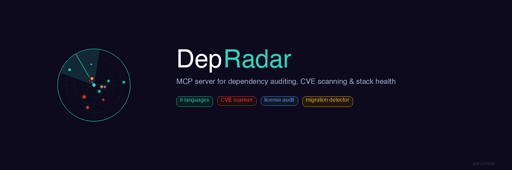

<p align="center">
  
</p>
<p align="center">
  <strong>The most complete dependency audit MCP server.</strong><br>
  <sub>Scan · Audit · Update · Migrate — 9 languages, 23 tools, one MCP server</sub>
</p>
<p align="center">
  
  
  
  
  
</p>

<p align="center">
  <a href="cursor://anysphere.cursor-deeplink/mcp/install?name=depsonar&config=eyJ0eXBlIjoic3RkaW8iLCJjb21tYW5kIjoibnB4IiwiYXJncyI6WyIteSIsImRlcHNvbmFyQGxhdGVzdCJdfQ=="></a>
</p>

**depsonar** is an MCP server that keeps your projects' dependencies up to date, scans for vulnerabilities, detects framework migrations, and audits your entire dev infrastructure — directly from Cursor, Claude, or any MCP-compatible AI assistant.

Supports **Node.js**, **Python**, **Rust**, **Go**, **PHP**, **Ruby**, **Dart/Flutter**, **Swift**, and **Kotlin/Java**.

---

## Why depsonar?

With AI-generated "vibe coding" projects, dependency maintenance is an afterthought. WordPress solved this with one-click updates. **depsonar** brings the same experience to modern development — plus security scanning, migration detection, and infrastructure auditing.

---

## Features

### Dependency Management
- **Multi-language**: 9 languages, auto-detected
- **Framework-aware**: SvelteKit, Next.js, Nuxt, Astro, Django, Laravel, Express...
- **Safe updates**: 3 levels (patch/minor/latest) with dry-run preview
- **Batch operations**: Update all projects at once
- **Ecosystem grouping**: Results grouped by Svelte, Supabase, Tailwind, Vite, etc.

### Security & Compliance
- **Live CVE scanning** via [osv.dev](https://osv.dev) API (npm, PyPI, crates.io, Go, PHP, Ruby)
- **Framework CVE database**: Curated advisories for Svelte, Next.js, Vite, Express, Axios
- **Native audit integration**: npm audit, cargo audit, pip-audit, composer audit, govulncheck
- **Secret scanner**: Detects AWS keys, GitHub tokens, Stripe keys, database URLs, and more
- **License compliance**: Flags GPL/AGPL copyleft, non-commercial, and unknown licenses

### Migration & Maintenance
- **Migration detector**: Identifies code patterns that need changing (Svelte 4→5 runes, Next.js Pages→App Router)
- **Changelog preview**: See breaking changes before updating
- **Deprecated detection**: Finds unmaintained packages and suggests replacements
- **Health scores**: 0-100 per project based on deps, security, lockfile, runtime
- **Background checker**: Scheduled scans via macOS launchd or Linux cron

### Infrastructure Audit
- **Runtime versions**: Node.js, Python, Rust, Go, PHP, Ruby, Dart, Swift (EOL detection)
- **Global toolchain**: npm, pnpm, yarn, bun, cargo, pip, git, docker, vercel, supabase, wrangler
- **Docker image audit**: Detects outdated/EOL base images
- **GitHub Actions audit**: Flags deprecated actions across all workflows
- **Environment check**: .env sync, lockfile freshness, config validation

---

## Quick Start

### Option 1: npx (zero install)

Add to `~/.cursor/mcp.json`:

```json
{
  "mcpServers": {
    "depsonar": {
      "command": "npx",
      "args": ["-y", "depsonar"]
    }
  }
}
```

### Option 2: Global install

```bash
npm install -g depsonar
```

```json
{
  "mcpServers": {
    "depsonar": {
      "command": "depsonar"
    }
  }
}
```

### Option 3: Clone

```bash
git clone https://github.com/Soflution1/depsonar.git
cd depsonar && npm install && npm run build
```

```json
{
  "mcpServers": {
    "depsonar": {
      "command": "node",
      "args": ["/path/to/depsonar/dist/index.js"]
    }
  }
}
```

Restart Cursor after editing the config.

---

## All 23 Tools

| Tool | Description |
|------|-------------|
| `depsonar_scan` | Scan all projects for outdated deps |
| `depsonar_check` | Check a specific project |
| `depsonar_update` | Update a project's dependencies |
| `depsonar_update_all` | Batch update all projects |
| `depsonar_health` | Health score 0-100 for a project |
| `depsonar_install` | Fresh install with optional clean |
| `depsonar_audit` | Security scan (npm/pip/cargo audit) |
| `depsonar_cve` | Curated framework CVE advisory check |
| `depsonar_live_cve` | Real-time CVE scan via osv.dev API |
| `depsonar_changelog` | Changelogs & breaking changes before updating |
| `depsonar_migrate` | Framework migration detector |
| `depsonar_deprecated` | Deprecated & replaced package detection |
| `depsonar_secrets` | Secret & API key scanner |
| `depsonar_licenses` | License compliance (GPL/AGPL flags) |
| `depsonar_runtimes` | Runtime version check (EOL detection) |
| `depsonar_toolchain` | Global tool versions |
| `depsonar_docker` | Docker image audit |
| `depsonar_actions` | GitHub Actions audit |
| `depsonar_envcheck` | .env, lockfile, config validation |
| `depsonar_infra` | Full infrastructure report (everything) |
| `depsonar_alerts` | Instant alerts from background scans |
| `depsonar_setup_checker` | Setup automatic background scanning |
| `depsonar_config` | View/edit configuration |

---

## Background Checker

The background checker scans your projects on a schedule and caches results. When you open Cursor, `depsonar_alerts` reads the cache instantly — zero wait.

1. A lightweight script runs every N hours via macOS launchd or Linux cron
2. Scans all projects, compares versions with registries
3. Writes results to `~/.depsonar-cache.json`, exits immediately
4. Zero RAM between runs, zero AI tokens, zero cost

**Setup from Cursor:** "Setup background checking every 6 hours"

---

## Configuration

Set your projects directory (auto-detected from `~/Cursor/App`, `~/Projects`, `~/Developer`, `~/Code`, `~/dev`):

```json
// ~/.depsonarrc.json
{
  "projectsDir": "/Users/me/my-projects"
}
```

Or from Cursor: "Set my projects directory to ~/Code"

---

## Supported Languages

| Language | Detected by | Package Manager |
|----------|------------|-----------------|
| Node.js | `package.json` | npm, pnpm, yarn, bun |
| Python | `requirements.txt`, `pyproject.toml`, `Pipfile` | pip, pipenv, poetry |
| Rust | `Cargo.toml` | cargo |
| Go | `go.mod` | go |
| PHP | `composer.json` | composer |
| Ruby | `Gemfile` | bundler |
| Dart/Flutter | `pubspec.yaml` | pub |
| Swift | `Package.swift` | swift |
| Kotlin/Java | `build.gradle.kts` | gradle |

## Framework Detection

SvelteKit · Next.js · Nuxt · Astro · Remix · SolidStart · Django · Flask · Laravel · Express · Fastify · Hono · Actix · Gin · Fiber

---

## Architecture

```
depsonar/
├── src/
│   ├── index.ts              # Entry: MCP server or --check mode
│   ├── checker.ts            # Background scanner (cron/launchd)
│   ├── dashboard.ts          # Web dashboard (http://127.0.0.1:24681)
│   ├── constants.ts          # Language markers, ecosystem patterns
│   ├── types.ts              # TypeScript interfaces
│   ├── schemas/index.ts      # Zod input validation
│   ├── services/
│   │   ├── project.ts        # Multi-lang detection, outdated parsing
│   │   ├── formatter.ts      # Reports, tables, alerts formatting
│   │   ├── audit.ts          # Native security audit (npm/cargo/pip)
│   │   ├── cve.ts            # Curated CVE advisory database
│   │   ├── osv.ts            # Live CVE via osv.dev API
│   │   ├── changelog.ts      # Changelog & breaking change detection
│   │   ├── migrate.ts        # Framework migration detector
│   │   ├── deprecated.ts     # Deprecated package detection
│   │   ├── secrets.ts        # Secret & token scanner
│   │   ├── licenses.ts       # License compliance checker
│   │   ├── runtimes.ts       # Runtime version checker
│   │   ├── toolchain.ts      # Global toolchain checker
│   │   ├── docker.ts         # Docker image auditor
│   │   ├── actions.ts        # GitHub Actions auditor
│   │   └── envcheck.ts       # Environment validator
│   └── tools/index.ts        # 23 MCP tools
├── static/
│   ├── logo.png              # depsonar logo (512x512)
│   └── banner.png            # GitHub banner (1800x600)
├── package.json
├── tsconfig.json
└── LICENSE (MIT)
```

---

## CLI

```bash
depsonar              # Start MCP server (for Cursor)
depsonar --check      # Run background scan
depsonar --version    # Show version
depsonar --help       # List all 23 tools
```

---

## Also by Soflution

- **[brandcheck](https://github.com/Soflution1/brandcheck)** — Check brand name availability across 27 platforms in one shot. Domains, social media, app stores, trademarks.

---

## License

MIT — [Soflution Ltd](https://soflution.com)
